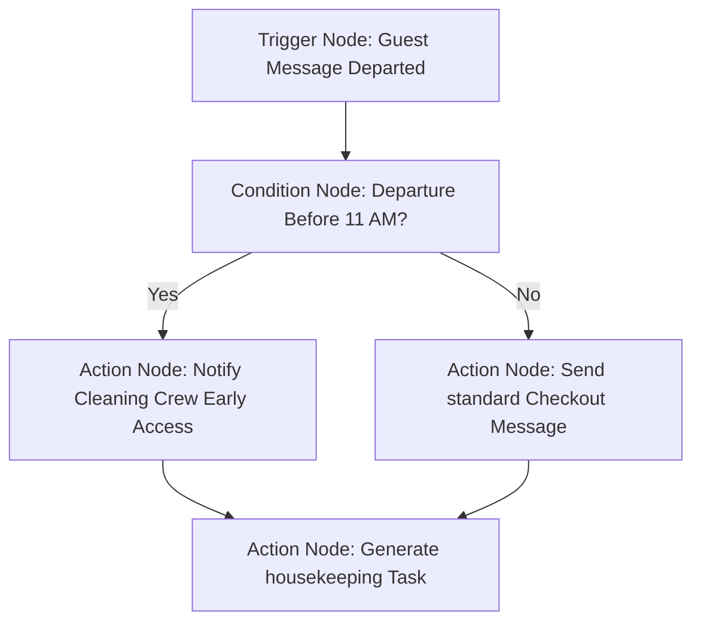

# PRD — Workflow & SOP Builder v2.0 (AI-Native & Visual)

> **ARCHIVED — Superseded 2026-05-28.** This v2.0 draft was reviewed by six
> dimension-specific reviewers (schema, build-plan, decisions, playbooks
> alignment, architecture, UX screenshots) and the architectural overshoots
> (visual node-graph authoring canvas, thread-adjacent inbox monitor, real-time
> PMS field hydration) were rejected; the five UX primitives worth lifting
> were integrated into the canonical
> [PRD_WORKFLOW_SOP_BUILDER.md](PRD_WORKFLOW_SOP_BUILDER.md) as G8/G9/G10 +
> R-lifts. The three architectural decisions the review locked
> ([DECISIONS.md](DECISIONS.md) D-039 step-list canonical / D-040 per-step
> regeneration provenance / D-041 layout-out-of-snapshot) supersede any
> conflicting claim below. This file is preserved as the source-of-record for
> the deliberation chain — **not as live spec.** Read the canonical v1 PRD and
> the three D-### entries for the in-force shape.

**Status:** ~~Draft v2.0~~ ARCHIVED — see header note above.
**Date:** 2026-05-28
**Owner:** pgrennell
**Inspiration:** [getbesty.ai/features/workflow-sop-builder](https://www.getbesty.ai/features/workflow-sop-builder) (friendly parity with PM-side cross-repo partner per D-024..D-033) + 2026-05-28 detailed Storylane UX reference capture
**Supersedes:** ~~PRD v1.5~~ — reverted; the canonical PRD remains v1.5 with the R-lifts integrated.

---

## 1. Background and architectural frame

The Builder Pass 3 work shipped in Phase 5 gives operators a powerful authoring canvas with draft/publish, dry-render preview, and field-key locking ([docs/UX_SPEC.md](UX_SPEC.md) §5, [docs/DECISIONS.md](DECISIONS.md) D-017–D-020). The underlying schema in [packages/database/drizzle/schema/workflows.ts](../packages/database/drizzle/schema/workflows.ts) is strong: versioned, snapshot-immutable, audit-only governance, mode-aware participants.

What it doesn't have is the *on-ramp*. Operators start at a blank canvas, must learn the palette, and have no way to express "this workflow applies to my pet-friendly homes but not the rest." Besty's pitch — "turn any SOP into a visual, branching workflow in plain English" — is exactly the wedge our v1 pivot (D-021: AI-credible v1) calls for.

But: Besty's builder feels effortless because **they hard-coded the nouns**. STR is a fixed world — Listing, Guest, Reservation, Owner. Templates like "Late Checkout" and "Pet Approval" are written *against those nouns*. Narrowness is the feature. The moment a horizontal builder loses those fixed nouns, the naive result is n8n: powerful, intimidating, the opposite of "describe it and it builds itself."

The whole design problem reduces to one sentence: **keep Besty's "it just works for my world" feel while making the underlying nouns configurable.**

### 1.1 The three-layer architecture

This PRD adopts the three-layer architecture from the 2026-05-27 strategic conversation. v2.0 ships the **seams** for each layer; the full configurable build of Layer 1 is a separate post-v1 phase (per D-034).

| Layer | What it is | What v2.0 ships | What's deferred |
|---|---|---|---|
| **Layer 1 — Configurable entity model** | A custom-object system: tenants define entity types with typed fields, statuses, and relationships. STR = Listing → Guest → Reservation; commercial = Building → Suite → Tenant → Lease → WorkOrder → Vendor; IT Ops = Site → Asset → Incident → Ticket. Hybrid storage (core columns + JSONB attrs + relationship graph). | **Seams only.** `entity_set` (with `entity_type` discriminator) replaces the v1-draft `listing_cohort`. A thin entity-adapter TS interface fronts entity lookups. Only `entity_type='listing'` is wired in v2.0. | Full custom-object system (tenant-defined entity types, JSONB attrs, relationship graph, UI). Post-v1 phase. |
| **Layer 2 — Vertical-agnostic workflow engine** | Triggers (entity events + schedules + inbound comms + webhooks + manual) → conditions/branches (rules over entity fields + context) → composable actions (send message, create/assign task, update entity, request approval, wait/delay, escalate, call integration, generate document, run AI step). Scope = filter over an entity set. | Generalize the cohort filter into entity-set scoping. Document the existing action vocabulary as the v1 composable set. Run-launch dispatcher reads `entity_set` membership. **Visual flowchart canvas and drag-and-drop template variables panels** (§6.2). | Entity-event triggers (Phase 6+18). Inbound-comms triggers (S-09, v1.1+). Webhook triggers beyond cross-repo. |
| **Layer 3 — AI authoring layer** | LLM takes plain-English description + the **tenant's entity schema** + the action vocabulary → emits a validated structured workflow graph. Grounding in the tenant's real schema is what makes a horizontal builder feel like Besty. | AI authoring procedures on the agents oRPC router; system prompt embeds the tenant's entity schema (in v2.0: the property-ops fixed set, fetched from the entity adapter and cached); Zod validator checks entity references are real. **Interactive side-by-side prompt and canvas generation with per-step refining** (§6.3). | Vertical-agnostic AI grounding once Layer 1 is configurable. Same code path, different cached schema per tenant. |

### 1.2 The three-views unification (an architectural commitment)

Besty keeps its Knowledge Base and Workflow Builder as separate features — same content lives in two places, edited twice. Virn makes a different call: **the SOP, the KB article, and the runnable workflow are three views of one object**.

- **Author view** — the visual flowchart builder canvas (§6.2). Edits the workflow's source of truth. See design layout: [storylane-step-06.png](file:///c:/Projects/Virn/virn-ops/docs/besty-ux-reference/storylane-step-06.png).
- **Read view** — the published version rendered as an SOP / KB article. Read-only, acknowledgeable, searchable. No "Start a run" button (runs launch from listings / triggers / runs index).
- **Execute view** — what a run participant sees when actually performing a step. Already exists (the run UI).

Editing the workflow in Author view updates Read view automatically (and propagates to Execute view on next publish via the existing snapshot mechanism). The AI authoring layer can both **tell someone how a process works** (read-view rendering + RAG) and **run it** (run engine) from the same object. This is the human / AI / agent-executable bridge from day one — Besty doesn't have it.

### 1.3 The discipline ("configurable underneath, never blank on top")

The trap that kills every horizontal/configurable tool: configurability tempts you to expose a blank canvas, and a blank canvas destroys the Besty feel. The discipline that v2.0 commits to:

> **Configurable underneath, never blank on top.** Every customer lands inside a pack with live templates and the AI author. Never an empty node graph.

Besty avoids the blank canvas by being narrow. Virn avoids it with **vertical packs + AI authoring**. v2.0 ships the property-ops pack (STR-first per D-034) as the v1 content wedge, with the architecture neutral enough that future packs (commercial PM, residential, IT Ops) are days of curation rather than months of engineering.

### 1.4 Horizontal positioning + pack ordering (D-034)

Virn is property-ops *horizontal* — D-021 locks the vertical domain to property operations (covering STR, long-term residential, commercial, multifamily, mixed-use), and D-034 specifies STR as the first sub-vertical within it. The v1 pack content ships STR-first; the *architecture* (three layers + three views) is neutral so additional packs (Commercial PM, Residential, IT Ops as proof-of-engine) can ship cheaply post-v1.

This PRD is property-ops-pack-aware: examples skew STR per D-034's dogfood profile, but no schema, validator, UX, or copy decision hard-codes an STR-only worldview.

---

## 2. Problem

Three concrete blockers prevent operators from moving SOPs out of Notion / Slack / heads:

1. **Blank-canvas tax.** Pass 3 requires the author to know the palette, dependency graph, and field-key conventions before they can express the SOP they already have. Time-to-first-publish is high.
2. **Rigid scoping.** Multi-property orgs need workflow differences by entity set — pet-friendly vs no-pets (STR), furnished vs unfurnished (LTR), retail vs office (commercial), garden vs mid-rise (multifamily). Today: duplicate the workflow per cohort and maintain N copies.
3. **No read-only reference; SOPs and workflows are siloed.** Even published workflows can only be encountered through a run. There's no "operator opens the SOP to remember the rule" surface (Process Street's KB gap from [docs/SCRATCHPAD.md](SCRATCHPAD.md)) — and even when there is, every other tool keeps KB and Builder as separate features that drift apart.

---

## 3. Users & jobs

| User | Job |
|---|---|
| **Property ops lead** (primary; STR-first per D-034 dogfood; same surface serves LTR, commercial, multifamily — typically 5–50 doors) | "Capture every recurring process so I stop being the bottleneck, without spending a Saturday in a builder." |
| **VA / on-site staff / contractor** (secondary) | "When I'm executing a turnover, a tenant request, a vendor coordination, or a guest issue, give me the canonical procedure I can read once and act on." |
| **Property owner / asset manager** (tertiary) | "Show me that the team has documented, repeatable processes for the things I care about." |

---

## 4. Goals

- **G1.** Operators paste/dictate an SOP and get an editable visual flowchart workflow draft within 60 seconds — not a blank canvas.
- **G2.** A workflow can be scoped to an entity set (in v2.0: a set of listings); no copy-paste duplication for variants.
- **G3.** AI authoring is **grounded in the tenant's entity schema** — the AI knows what entities exist and refers to them by name, so outputs feel like "for my world" rather than generic templates.
- **G4.** The SOP / KB article / runnable workflow are reachable as three views of the same object. Editing once updates all three.
- **G5.** A `draft → in_review → published` lifecycle gives orgs an optional gate before a workflow goes live.
- **G6.** A starter pack of property-ops templates spans STR, LTR, commercial, multifamily, and cross-cutting flows. Curated as the first instance of the Vertical Pack primitive (D-034: STR-leaning for v1 dogfood).
- **G7.** The schema seams (entity_set + entity_type discriminator + entity adapter interface) make Layer 1's full configurable entity model a content-and-UI build later, not a schema migration.

---

## 5. Non-goals (v2.0)

- Full Layer-1 configurable entity model (custom objects, tenant-defined entity types, JSONB attribute UI, relationship graph editor). Post-v1 phase.
- Multi-pack support (Commercial PM pack, Residential pack, IT Ops pack) — deferred per D-034. v2.0 ships seams that make these cheap later.
- Entity-event triggers, inbound-comms triggers, webhook triggers (Phase 6, Phase 18, v1.1+).
- Conditional step visibility (Phase 6).
- Automation rule firing (Phase 6).
- `dueType ∈ {offset_from_step, from_date_field}` (Pass 4).
- Agent step execution (Phase 11 — the `step.type='ai'` enum value stays a reserved seam).
- Voice input for AI authoring.
- In-house concierge review service (we ship the flag, not the team).
- Multi-org template marketplace.

---

## 6. Scope — six capabilities organized by layer

### 6.1 Layer 1 seams — `entity_set` + entity adapter

**Model.**
- New table `entity_set` (org-scoped, named, color label, `entity_type` discriminator).
- New table `entity_set_member` — polymorphic by `entity_type` + `entity_id`. In v2.0, `entity_type` is constrained to `'listing'`; the column exists so the model is entity-agnostic without future schema breakage.
- New column `workflow.entity_set_ids uuid[] DEFAULT '{}'` — empty array means "applies to all entities of any type" (preserves current behavior).

**Entity adapter (TS interface).**

```ts
interface EntityAdapter<T extends EntityType> {
  type: T;
  listForOrg(orgId: string): Promise<EntityRef[]>;
  getById(orgId: string, id: string): Promise<EntityRef | null>;
  schemaForAI(): EntitySchemaForAI;  // describes the entity to the AI authoring system prompt
}
```

In v2.0 there's exactly one implementation: `ListingAdapter`. Adding `BuildingAdapter`, `IncidentAdapter`, etc. post-v1 is additive — no changes to `entity_set`, the workflow engine, or the AI authoring layer beyond registering the adapter.

**Why this matters for v2.0.** The cost of naming it `entity_set` vs `listing_cohort` is one column (`entity_type`) and one polymorphic join. The cost of *not* doing it is a forklift rename when Layer 1 lands. Cheap seam, expensive omission.

### 6.2 Layer 2 — generalized entity-set scoping + documented action vocabulary

**Builder UX.**
- Workflow settings panel gains a **Scope** section: multi-select of entity sets. Empty = applies to all. Example sets an org might create (STR-flavored per D-034 dogfood, but architecturally entity-type-agnostic):
  - STR (v2.0 dogfood profile): "Pet-Friendly Homes", "Luxury", "Beachfront", "Overseas Owners". Reference UI scoping setup: [marketing-section-03-scoping.png](file:///c:/Projects/Virn/virn-ops/docs/besty-ux-reference/marketing-section-03-scoping.png) and listing selection: [storylane-step-14.png](file:///c:/Projects/Virn/virn-ops/docs/besty-ux-reference/storylane-step-14.png).
  - LTR (post-v1, illustrative): "Section 8", "Furnished", "Single-Family"
  - Commercial (post-v1, illustrative): "Retail Ground Floor", "Office Suites"
  - IT Ops (post-v1, illustrative): "P1 Incidents", "Production Sites"
- Listings index gains an **Entity sets** column showing chip badges. (Future entity types will gain their own indexes with the same UI pattern.)
- Listing detail page gains an **Entity sets** field (multi-select, editable inline).

**Run launch behavior.**
- When `runs.launch` is invoked from an entity context, the dispatcher filters available workflows by `workflow.entity_set_ids ∩ entity.entity_set_ids ≠ ∅ OR workflow.entity_set_ids = '{}'`.
- When `runs.launch` is invoked workflow-first, no scope filtering; the user picks the entity freely (UI warns if mismatch).

**Reuse hook.** Entity sets become reusable for vendor-pool routing (D-027) — same set can later scope "which vendor pool serves these entities." Out of scope for v2.0 but the data model assumes it.

**Action vocabulary (documented, not new).** Layer 2 calls out the v1 action vocabulary that workflows compose from: task, approval, heading, one_off, [reserved: code, ai]. Documenting it explicitly in this PRD (rather than leaving it implicit in code) is the architectural commitment — the AI authoring layer treats this as the closed set it can emit. New action types are additive and gated through the same enum.

#### 6.2.1 Visual Flowchart Canvas Specification

To provide an intuitive, high-fidelity experience, the Author View is built around an interactive **Visual Flowchart Canvas** using a nodes-and-edges topology rather than a simple sequential checklist. (See flowchart generated: [storylane-step-06.png](file:///c:/Projects/Virn/virn-ops/docs/besty-ux-reference/storylane-step-06.png) and manual node editing connectors: [storylane-step-17.png](file:///c:/Projects/Virn/virn-ops/docs/besty-ux-reference/storylane-step-17.png)).



1.  **Canvas Interaction**:
    *   **Drag-and-Drop Editing**: Users can drag nodes from a side palette onto the canvas to construct the operational path. Reference node drag UI: [storylane-step-17.png](file:///c:/Projects/Virn/virn-ops/docs/besty-ux-reference/storylane-step-17.png).
    *   **Arrows & Edges**: Direct graphical edges with editable directional flows that link the outputs of one step to the inputs of subsequent steps.
2.  **Visual Palette Node Elements**:
    *   **Trigger Nodes (Green)**: Event entry-points (e.g. Guest Message Received, Check-in Complete, Form Submitted). Reference: [storylane-step-07.png](file:///c:/Projects/Virn/virn-ops/docs/besty-ux-reference/storylane-step-07.png).
    *   **Condition Nodes (Orange)**: Branching decision gates based on logical rules (e.g., boolean outputs, PMS data comparisons, or response flags). Reference split gates: [storylane-step-08.png](file:///c:/Projects/Virn/virn-ops/docs/besty-ux-reference/storylane-step-08.png) and conditional rules: [storylane-step-09.png](file:///c:/Projects/Virn/virn-ops/docs/besty-ux-reference/storylane-step-09.png).
    *   **Action Nodes (Blue)**: Task execution steps (e.g. creating PMS tasks, dispatching SMS alerts, requesting compliance approvals). Reference action fields: [storylane-step-11.png](file:///c:/Projects/Virn/virn-ops/docs/besty-ux-reference/storylane-step-11.png).
    *   **Arrow Connectors**: Click-and-drag line connectors linking anchor ports on each node to define execution sequence.

#### 6.2.2 Template Variables Dynamic Sidebar

To bridge multi-tenant custom entities and dynamic text inputs, the builder features a **Template Variables Sidebar** on the bottom-left panel. Reference layout: [storylane-step-16.png](file:///c:/Projects/Virn/virn-ops/docs/besty-ux-reference/storylane-step-16.png).

*   **PMS/CRM Fields Hydration**: Populates real-time system context (e.g. `grill_code`, `parking_spot`, `guest_name`, `arrival_date`) synced directly from active listing integrations.
*   **Drag-and-Drop Text Insertion**: Authors can drag variables from the sidebar directly into text areas (such as Action Titles, Message Bodies, or Task Descriptions) to insert a dynamic data merge token (e.g. `{{listing.parking_spot}}`).

---

### 6.3 Layer 3 — AI SOP authoring grounded in tenant entity schema

**The architectural commitment.** AI authoring must ground in the **tenant's actual entity schema**, not generic placeholders. This is what makes a horizontal builder feel like Besty even when the underlying nouns are configurable. In v2.0 the "tenant entity schema" is the property-ops fixed set (listing today; vendor, owner, work_order as Phase 8 schema is already in place); when Layer 1 ships, the same code path serves tenant-defined entities.

**Entry points.**
- New button in the workflow list: **"Describe an SOP"** (sits beside "New blank workflow" and "Install from templates").
- New section in onboarding: "Have an existing SOP? Paste it here." Reference UI placement: [marketing-section-01-hero.png](file:///c:/Projects/Virn/virn-ops/docs/besty-ux-reference/marketing-section-01-hero.png).

**Input modes (v2.0b).**
- Free-text prompt — placeholder rotates across property-ops types so the affordance reads as horizontal even with STR-first content (reference prompt input panel: [storylane-step-02.png](file:///c:/Projects/Virn/virn-ops/docs/besty-ux-reference/storylane-step-02.png) and prompt text: [storylane-step-03.png](file:///c:/Projects/Virn/virn-ops/docs/besty-ux-reference/storylane-step-03.png)):
  - STR: "Pets are allowed only with a $200 fee; photos of the pet required; cleaner gets a heads-up."
  - LTR: "When a tenant gives 60-day notice, schedule a move-out inspection, coordinate cleaner and painter, post the listing 30 days out, route security-deposit reconciliation to ops manager for sign-off."
  - Commercial: "Quarterly HVAC service — notify tenant 5 business days ahead, send vendor a work order with after-hours access details, capture service report, file with insurance binder."
  - Multifamily: "Resident reports a leak — log to maintenance system, dispatch on-call plumber within 2 hours, notify adjacent units if shutoff required, post-repair photo and resident sign-off."
- Paste of SOP text from Notion / Word / Google Docs (markdown- or plain-text-pasted).
- File upload of `.txt` / `.md` / `.pdf` (PDF text extracted client-side; if extraction fails, prompt for paste). Reference file drop zone: [storylane-step-02.png](file:///c:/Projects/Virn/virn-ops/docs/besty-ux-reference/storylane-step-02.png).

**Pipeline.**
1. Client sends `{prompt, sourceText?, fileName?, entitySetHints?}` to `agents.authorWorkflow` oRPC procedure.
2. Server fetches the tenant's entity schemas via the entity adapter registry.
3. Server calls Claude API with a system prompt that embeds:
   - The builder's JSON contract + the palette/dueType constraints (§10).
   - **The tenant's entity schemas** — what entities exist, their fields, their relationships. The AI is told it may reference these by name in step descriptions, field labels, and `entityReference` payloads.
   - The action vocabulary from §6.2.
   - Few-shot examples drawn from the starter pack (§6.5).
4. Claude returns a strict-JSON `WorkflowDraft` object matching the builder mutation contract.
5. Server validates with Zod; cross-references entity-references against the live entity schema (rejects "for each Booking" if no `Booking` entity exists); on schema failure, retries once with the validator error appended; on second failure, surfaces "couldn't parse your SOP — try simplifying" to the user. Reference generation loading state: [storylane-step-04.png](file:///c:/Projects/Virn/virn-ops/docs/besty-ux-reference/storylane-step-04.png).
6. Server creates a `draft` workflow + `workflow_version` + steps/fields and returns the workflow id.
7. Client routes to `/library/workflows/[id]?view=author&aiAuthored=1` with the side-by-side review pane open.

#### 6.3.1 AI Generation Workspace & Interactive Refinement

The AI generation step does not immediately overwrite the canvas. It loads inside a dedicated **Side-by-Side Authoring Workspace**. Reference visual result: [storylane-step-05.png](file:///c:/Projects/Virn/virn-ops/docs/besty-ux-reference/storylane-step-05.png).

*   **Side-by-Side Review Pane**:
    *   **Left Pane**: The original input text, markdown, or file source that the user submitted.
    *   **Right Pane**: The live visual flowchart rendered immediately in read-only form, showcasing nodes, branching conditions, and variable mappings.
*   **Per-Node / Per-Step Refinement**:
    *   Each generated node displays a settings gear and a **Regenerate Step** button.
    *   Clicking this allows the user to write a targeted refinement prompt (e.g. *"Actually, make this notification send via SMS instead of email and attach the guest's phone number"*).
    *   The server communicates with the agents oRPC router to update that specific node's logic without re-generating the entire canvas, keeping user-authored manual adjustments intact.

#### 6.3.2 Thread-Adjacent Live Execution & Monitoring Panel

When a workflow is executing (Run State), the interface provides a **Thread-Adjacent Live Monitor** docked directly to the right-hand panel of the guest/tenant communication thread (Active Inbox view).

*   **Flowchart Execution Overlay**: Renders the visual flowchart in real-time, coloring nodes dynamically (Green = Completed, Orange = Active, Gray = Pending) so operators see the exact stage the background AI or automated tasks are in. Reference panel: [Case 1/storylane-step-08.png](file:///c:/Projects/Virn/virn-ops/docs/besty-ux-reference/Case%201/storylane-step-08.png).
*   **Conversation Task Auto-Detection**:
    *   The sidebar automatically displays parsed checklist items and tasks detected in the inbox thread (e.g., *"Guest requested firewood"* or *"Dishwasher reported broken"*). Reference active sidebar task summary: [Case 1/storylane-step-10.png](file:///c:/Projects/Virn/virn-ops/docs/besty-ux-reference/Case%201/storylane-step-10.png) and [Case 2/storylane-step-06.png](file:///c:/Projects/Virn/virn-ops/docs/besty-ux-reference/Case%202/storylane-step-06.png).
    *   Clicking any auto-detected task expands the details inline, showing the target description, automatically assigned listing properties, and direct links to the PMS/operations portal. Reference synced operations task detail: [Case 1/storylane-step-11.png](file:///c:/Projects/Virn/virn-ops/docs/besty-ux-reference/Case%201/storylane-step-11.png).

---

### 6.4 Three-views unification (Author / Read / Execute)

**The model.** One workflow object; three views over its published version.

| View | URL | Surface | Permissions |
|---|---|---|---|
| **Author** | `/library/workflows/[id]?view=author` (default for authors) | Visual Flowchart Canvas, palette, and variables sidebar | Author / Admin / Owner |
| **Read** | `/library/workflows/[id]?view=read` (default for readers) | SOP/KB markdown rendering: steps, descriptions, field labels, role hints, expected outputs. "Mark as read" action. | Any org member |
| **Execute** | `/runs/[runId]` (unchanged from today) | Run engine UI: live field inputs, complete actions, comments/activity, thread-adjacent monitor | Run participants |

**Browse-ergonomic surfaces.**
- `/library/workflows` — authors' index (all states, all workflows the user can see).
- `/sop` — readers' index (published only, opens detail pages in `?view=read`). Both lead to the same `/library/workflows/[id]` detail page; the `view` query param controls mode. Authors landing in `?view=read` see a toggle to switch to author; readers landing in `?view=author` are redirected to read mode if they lack write perms.

**Acknowledgements.**
- Read view's **Mark as read** button → inserts `sop_read_receipt` row (`workflow_id`, `version`, `user_id`, `read_at`).
- Org admins see per-workflow read receipts on the workflow detail page in any view ("12 of 17 ops members have read this SOP").
- Reconciliation note: existing `acknowledgment` table (used by Phase 16 governance flows) is for *active sign-off* (compliance). `sop_read_receipt` is for *passive read*. Both can render on the same timeline at Phase 15 if useful.

**Permissions.**
- Read view: any org member with `member` role or above.
- Author view: existing builder permissions unchanged.
- Editing in Author view updates Read view immediately on save (draft) or on publish (published). Snapshot-immutability per D-019 preserved — Read view of a published version always reflects that snapshot.

**Strict no-execution constraint.** Read view never shows a "Start a run" button. Runs launch from entity contexts (listings index, run dispatcher, triggers) — keeps the mental model clean and matches the SCRATCHPAD note about Process Street's KB gap.

### 6.5 Property-ops starter pack content (the first Vertical Pack)

**Pack framing.** Per the 2026-05-27 architectural reframe (and D-034), the GTM unit is the **Vertical Pack** = entity schemas + workflow templates + integration presets + AI vocabulary for grounding. v2.0 ships the property-ops pack's *workflow template library* as a refreshed curated set; entity schemas + integration presets + AI vocabulary for this pack already exist in the codebase (Phase 17a, the vendor module, the AI authoring system prompt).

**Curation goal.** Span property-ops types out of the box so an org of any property mix sees relevant starters on first install. STR-leaning by count per D-034 dogfood profile, but horizontal in surface area to keep the engine honest.

| Property-ops type | Templates |
|---|---|
| **STR / vacation rental** (Besty parity + STR-native; v2.0 dogfood lead) | Pet Approval Request · Noncritical Dishwasher Issue Triage · Discount Request Handling · Guest Complaint Escalation · Inbound Departure Call Routing · Lockout Resolution · Early Check-In Request · Late Checkout Request · Post-Stay Review Request · STR Turnover & Housekeeping (standard) · Deep-clean cadence · Pre-arrival prep |
| **Long-term residential** | Lease renewal · Move-in (tenant onboarding + walkthrough) · Move-out (inspection + deposit reconciliation) · Late-rent collection · Resident complaint / nuisance triage · Periodic interior inspection |
| **Commercial** (office / retail / industrial) | Tenant fit-out coordination · Quarterly preventive-maintenance dispatch · Certificate-of-insurance refresh · After-hours access request · Lease expiration / renewal notice · CAM reconciliation prep |
| **Multifamily** | Common-area inspection · Amenity-incident response · Mid-lease unit inspection · Building-system outage response |
| **Cross-cutting** (any property type) | Maintenance work-order triage · Vendor onboarding (insurance, W-9, scope of work) · Owner / asset-manager monthly report · Emergency response (fire / flood / outage) · New-listing / new-unit setup |

**Mechanics.**
- All ship as platform-published `template_listing` rows (`publisherOrganizationId IS NULL`) using the existing install flow ([packages/database/drizzle/schema/library.ts](../packages/database/drizzle/schema/library.ts)).
- AI authoring (§6.3) uses templates as priors via a "similar to…" affordance: `"Like Late Checkout Request but for pets"`, `"Like Periodic Inspection but quarterly"`, `"Like Move-Out but for furnished short-term lease"`. Server fetches the template version + appends to the system prompt.
- Templates surface in the builder onboarding: "Install a template", "Describe your own", "Start blank" — with "Start blank" the third option, never the default (per §1.3 discipline).

### 6.6 Review states

**Lifecycle change.**
- Current: workflow versions are `draft` or `published` (or `archived`).
- v2.0: add `in_review` between `draft` and `published`.
- New column `workflow.review_state pg_enum('draft','in_review','published','archived')` (workflow-level lifecycle, independent of version snapshots).

**Per-org gate.**
- New org setting `requireConciergeReview: boolean` (default `false`).
- When `true`, the "Publish" button on a draft becomes "Submit for review", which transitions to `in_review` and notifies org admins.
- Admins see an inbox: **Workflows awaiting review** with diff against last published version (uses existing `getVersionEditBundle` query) and **Approve & publish** / **Send back to draft** actions. Reference queue: [storylane-step-19.png](file:///c:/Projects/Virn/virn-ops/docs/besty-ux-reference/storylane-step-19.png) and approval screen: [storylane-step-21.png](file:///c:/Projects/Virn/virn-ops/docs/besty-ux-reference/storylane-step-21.png).

**Concierge stays opt-in self-serve (per D-034 / proposal decision #3).**
- We do not provide an in-house review service in v2.0. The flag exists so orgs can wire their own internal review gate.
- Audit row on every transition (who, when, action).

---

## 7. UX flows

**Flow A — AI SOP authoring (happy path).**
1. Operator clicks **Describe an SOP** on the workflow list.
2. Modal: text area + file drop + "Use template as starting point" picker. Submits.
3. Loader (5–15s typical) → routes to `/library/workflows/[id]?view=author&aiAuthored=1` with the side-by-side prompt and visual flowchart review workspace.
4. Operator clicks the **Regenerate** button on the dishwasher task node to modify the W-9 collection action, submits a text refinement, and reviews the updated node visually.
5. Operator clicks **Accept all**.
6. Visual flowchart transitions into the active builder canvas where variables can be dragged. Operator publishes (or submits for review).

**Flow B — Entity-set-scoped run launch.**
1. Operator opens a listing, clicks **Launch run**.
2. Workflow picker shows only workflows where `entity_set_ids` is empty OR intersects the listing's entity sets (entity-set chip badges shown for context).
3. Picks workflow, run launches as today.

**Flow C — Review-required publish.**
1. Operator finishes draft, clicks **Submit for review** (button label flipped because org has `requireConciergeReview: true`).
2. Workflow moves to `in_review` state; org admins notified.
3. Admin opens the diff view, approves → workflow publishes; or sends back with a comment.

**Flow D — Live Thread-Adjacent Run Monitoring.**
1. Guest sends a message saying they have checked out early.
2. The inbox sidebar highlights a newly auto-detected checklist task: *"Guest checkout reported early (Departure: 10:15 AM)"*.
3. The right-hand active workflow panel lights up: the Trigger node goes Green, the branching Condition Node resolves early checkouts, and the Action Node targeting early cleaning crew dispatch goes Orange.
4. The operations manager clicks the task in the sidebar to open the full PMS work order.

---

## 8. Data model & architecture

### 8.1 Schema deltas

```sql
-- New: Prerequisite — `listing` table
CREATE TABLE listing (
  id uuid PRIMARY KEY,
  organization_id uuid NOT NULL REFERENCES organization(id),
  name text NOT NULL,
  external_listing_id text,    
  property_type text,          
  address jsonb,               
  created_at timestamptz NOT NULL DEFAULT now(),
  updated_at timestamptz NOT NULL DEFAULT now(),
  deleted_at timestamptz
);

CREATE UNIQUE INDEX listing_org_external_id_uniq
  ON listing (organization_id, external_listing_id)
  WHERE external_listing_id IS NOT NULL;

-- New: Layer-1 seam
CREATE TYPE entity_type AS ENUM ('listing'); 

CREATE TABLE entity_set (
  id uuid PRIMARY KEY,
  organization_id uuid NOT NULL REFERENCES organization(id),
  entity_type entity_type NOT NULL,
  name text NOT NULL,
  color text,
  created_at timestamptz NOT NULL DEFAULT now(),
  UNIQUE (organization_id, entity_type, name)
);

CREATE TABLE entity_set_member (
  entity_set_id uuid NOT NULL REFERENCES entity_set(id) ON DELETE CASCADE,
  entity_type entity_type NOT NULL,
  entity_id uuid NOT NULL,
  PRIMARY KEY (entity_set_id, entity_type, entity_id),
  CHECK (
    (entity_type = 'listing' AND EXISTS (SELECT 1 FROM listing WHERE listing.id = entity_id))
  )
);

-- New: review state
CREATE TYPE review_state AS ENUM ('draft','in_review','published','archived');

-- New: AI authoring provenance
CREATE TABLE ai_authoring_prompt (
  id uuid PRIMARY KEY,
  organization_id uuid NOT NULL REFERENCES organization(id),
  user_id uuid NOT NULL REFERENCES "user"(id),
  prompt text NOT NULL,
  source_text text,
  response_json jsonb NOT NULL,
  entity_schema_snapshot jsonb NOT NULL, 
  model text NOT NULL,
  created_at timestamptz NOT NULL DEFAULT now()
);

-- New: Read view acknowledgments
CREATE TABLE sop_read_receipt (
  workflow_id uuid NOT NULL REFERENCES workflow(id),
  workflow_version int NOT NULL,
  user_id uuid NOT NULL REFERENCES "user"(id),
  read_at timestamptz NOT NULL DEFAULT now(),
  PRIMARY KEY (workflow_id, workflow_version, user_id)
);

-- Altered: workflow gains scope, review state, AI provenance, and node canvas coordinates
ALTER TABLE workflow ADD COLUMN entity_set_ids uuid[] NOT NULL DEFAULT '{}';
ALTER TABLE workflow ADD COLUMN review_state review_state NOT NULL DEFAULT 'draft';
ALTER TABLE workflow ADD COLUMN ai_authoring_prompt_id uuid REFERENCES ai_authoring_prompt(id);
ALTER TABLE workflow ADD COLUMN canvas_nodes jsonb; -- holds visual coordinate, icon type, and connection positions
ALTER TABLE workflow ADD COLUMN canvas_edges jsonb; -- holds visual arrow line configurations and connected ports

-- Altered: org gains concierge-review flag
ALTER TABLE organization ADD COLUMN require_concierge_review boolean NOT NULL DEFAULT false;
```

---

## 9. Constraints honored (Pass 3 invariants)

| Invariant | Where it comes from | How v2.0 respects it |
|---|---|---|
| Palette gates on `isEnabled` | Memory note on Pass 3 constraints | AI authoring system prompt restricts emitted step types to the enabled set |
| Key rename = AWAIT | Memory note on Pass 3 | No change — AI-generated keys go through same lifecycle |
| `FIELD_KEY_LOCKED` drives "clear references first" | D-017 + memory | AI never emits a rename; locked-chip mechanic unchanged |
| Locked-chip can't be triggered in-app until conditions/due-rules ship | Memory note | AI emits `precondition_note` comments on conditionally-relevant steps; no in-app trigger before Phase 6 |
| `due_type` UI must match what `launchRun` resolves | Memory + `launch-run.ts:241-248` | AI restricted to `none` / `offset_from_start`; no UI exposure of deferred modes |
| Top-level routes must be in `forbiddenOrganizationSlugs` | Memory note | `sop` added to [packages/auth/config.ts](../packages/auth/config.ts) + snapshot in the same migration as the route |
| Org-scoping invariant | [docs/ARCHITECTURE.md](ARCHITECTURE.md) §4 | All new tables org-scoped or composite-keyed through org-scoped parents |
| Snapshot immutability on publish | [docs/ARCHITECTURE.md](ARCHITECTURE.md) §5 + D-019 | Review states are workflow-level, not version-level — no change to snapshot semantics. Read view of a published version always reflects that snapshot. |

---

## 10. Phasing

**Total: ~5 weeks** (Unchanged, visual UI tracks with existing Phase 5 builder canvas sprints).

*   **v2.0a — Layer-1 seams + Layer-2 scoping & Visual Canvas + review states (2 weeks)**:
    *   Listing table baseline and CRUD.
    *   `entity_set` migrations, adapter registry.
    *   Visual Canvas nodes-and-edges renderer integration on Author View.
    *   Template Variables Sidebar UI drag-and-drop wiring.
*   **v2.0b — Layer-3 AI authoring & Workspace + Thread Sidebar (2 weeks)**:
    *   oRPC AI Author procedure, Claude prompt caching.
    *   Side-by-side review workspace with per-step regeneration.
    *   Active thread-adjacent live monitor dashboard sidebar.
*   **v2.0c — Three-views unification (1 week)**:
    *   `/sop` index, Read view render, acknowledgement receipt logs.

---

## 11. Success metrics

| Metric | Target |
|---|---|
| % of new workflows started via AI authoring vs blank canvas | >60% by day 30 |
| Median time from "Describe an SOP" submit → "Accept all" → publish | < 10 min |
| Templates installed per org (first 7 days after signup) | ≥ 3 |
| Entity-set-scoped workflows per org (orgs with > 1 entity set) | ≥ 1 per set by day 30 |
| `/sop` weekly active readers / total org members | > 40% |
| Read-receipt coverage on most-active SOP per org | > 70% of intended audience |
| AI output entity-reference validation pass rate (first try) | > 85% |
| Drag-and-drop variables usage per newly published workflow | ≥ 2 variables referenced |

---

## 12. Visual UX Reference Appendix

This appendix maps specific requirements in the PRD to the captured design references saved under `docs/besty-ux-reference/`.

### 12.1 Marketing Page Embed Layouts
*   **Active Tab Swapping & Dynamic Iframe Hydration**:
    *   Overview chapter initial page loaded: [marketing-section-01-hero.png](file:///c:/Projects/Virn/virn-ops/docs/besty-ux-reference/marketing-section-01-hero.png).
    *   Use Case 1 (Non-critical issue) loaded: [marketing-section-01a-case1.png](file:///c:/Projects/Virn/virn-ops/docs/besty-ux-reference/marketing-section-01a-case1.png).
    *   Use Case 2 (Checkout timing) loaded: [marketing-section-01b-case2.png](file:///c:/Projects/Virn/virn-ops/docs/besty-ux-reference/marketing-section-01b-case2.png).
    *   Use Case 3 (Airbnb screening) loaded: [marketing-section-01c-case3.png](file:///c:/Projects/Virn/virn-ops/docs/besty-ux-reference/marketing-section-01c-case3.png).

### 12.2 Overview Tour Walkthrough Canvas References
*   **NL Dialog Input**: [storylane-step-02.png](file:///c:/Projects/Virn/virn-ops/docs/besty-ux-reference/storylane-step-02.png) shows the prompt entry area and file upload target.
*   **Flowchart Node Workspace**: [storylane-step-06.png](file:///c:/Projects/Virn/virn-ops/docs/besty-ux-reference/storylane-step-06.png) displays the generated flowchart grid with Trigger, Condition, and Action nodes.
*   **Conditional Branching rules**: [storylane-step-08.png](file:///c:/Projects/Virn/virn-ops/docs/besty-ux-reference/storylane-step-08.png) and [storylane-step-09.png](file:///c:/Projects/Virn/virn-ops/docs/besty-ux-reference/storylane-step-09.png) highlight logical check panels.
*   **Template Variables panel**: [storylane-step-16.png](file:///c:/Projects/Virn/virn-ops/docs/besty-ux-reference/storylane-step-16.png) represents the bottom-left merge variable tokens list.
*   **Manual Palette Connections**: [storylane-step-17.png](file:///c:/Projects/Virn/virn-ops/docs/besty-ux-reference/storylane-step-17.png) displays drag-and-drop arrow nodes.
*   **Review Queue Diff**: [storylane-step-19.png](file:///c:/Projects/Virn/virn-ops/docs/besty-ux-reference/storylane-step-19.png) and [storylane-step-20.png](file:///c:/Projects/Virn/virn-ops/docs/besty-ux-reference/storylane-step-20.png) show version comparison screens.

### 12.3 Operations & Live Thread Execution Sidebar References
*   **Conversation Active Inbox Trigger**: [Case 1/storylane-step-02.png](file:///c:/Projects/Virn/virn-ops/docs/besty-ux-reference/Case%201/storylane-step-02.png) and [Case 2/storylane-step-02.png](file:///c:/Projects/Virn/virn-ops/docs/besty-ux-reference/Case%202/storylane-step-02.png) show active threads.
*   **Thread-Adjacent progress panel**: [Case 1/storylane-step-08.png](file:///c:/Projects/Virn/virn-ops/docs/besty-ux-reference/Case%201/storylane-step-08.png) shows the right-hand active workflow indicator panel.
*   **Conversation Auto-detected tasks summary**: [Case 1/storylane-step-10.png](file:///c:/Projects/Virn/virn-ops/docs/besty-ux-reference/Case%201/storylane-step-10.png) and [Case 2/storylane-step-06.png](file:///c:/Projects/Virn/virn-ops/docs/besty-ux-reference/Case%202/storylane-step-06.png) show parsed operational checklist sidebar logs.
*   **PMS Synced operations task detail**: [Case 1/storylane-step-11.png](file:///c:/Projects/Virn/virn-ops/docs/besty-ux-reference/Case%201/storylane-step-11.png) shows task description and listing associations.
