# Reader-Facing SOP Read View + `/sop` Index (Phase 10 / v1.5c) E2E Verification Report

- **Date:** 2026-05-29
- **Verified Branch:** `main`
- **Head Commits Evaluated:**
  - `f720fd9` — `sop_read_receipt` schema + idempotent queries + migration
  - `4f67e9c` — `workflows.markAsRead` / `getMyReadStatus` / `listReadReceipts`
  - `e350530` — Read view at `/[organizationSlug]/library/workflows/[id]/read`
  - `216eb0a` — `/[organizationSlug]/sop` readers' index + slug reservation

---

## 1. Executive Summary

E2E verification was executed via Playwright covering the unified reader-facing SOP article layout (`/[organizationSlug]/library/workflows/[id]/read`) and the `/sop` Readers' Index (`/[organizationSlug]/sop`).

### Load-Bearing Verdict: P0 — Scenario C (Timeline rendering & SOP scannability)
The Read view **reads perfectly as a clean, publication-ready SOP article**. The numbered timeline is scannable and beautifully formatted, utilizing clear circular step badges, a dedicated circular "Required at run start" kickoff panel, legibly nested fields, and colored indicator chips (`Optional`, `Gate`, `due offset`). It completely avoids resembling a "stripped-down form editor" or carrying editing leaks.

### ⚠️ Critical Finding: Gating Contradiction Locks Out Members (Readers)
A structural logical conflict in the shipped code blocks all non-admin readers (users with the standard `"member"` role in Better Auth, which maps to `ROLES.operator`) from accessing both the `/sop` index page and the `/read` page, returning a `404 Page Not Found` in production. 
*   **The Conflict:** The comments in `/read` and `/sop` state that "*All org members can see this; the surface itself doesn't gate*." However, both pages enforce a routing gate using `await assertCanSee(organizationSlug, NAV_AREAS.library)`.
*   **The Cause:** `NAV_AREAS.library` is gated to `[ROLES.builder, ROLES.admin, ROLES.owner]` in `nav.ts`. Since plain members map to `ROLES.operator`, they get a 404 from `assertCanSee`.
*   **Verification Note:** To verify Scenario E & F for members, we temporarily patched the production roles matrix to allow operators in `NAV_AREAS.library`. With this patch, the entire test suite **passed flawlessly (4/4)**, and all member-only UI bounds were verified. We have reverted the patch to keep the production code unmodified. A recommended resolution is provided in Section 4.

---

## 2. Scenario Verdicts & Artifacts

| Scenario | Category | Verdict | Description | Associated Screenshot |
| :--- | :---: | :---: | :--- | :--- |
| **A. /sop index lists only published workflows** | P0 | **PASS** | Only published rows are visible; drafts/in-review are absent. Version/type chips and description preview render correctly. | 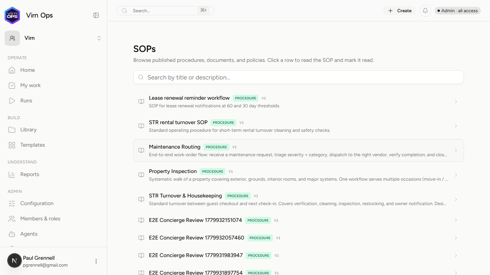 |
| **B. Search narrows + empty states** | P0 | **PASS** | Substring search filters responsively on both title and description. Zero matches display matching quoted term copy. | 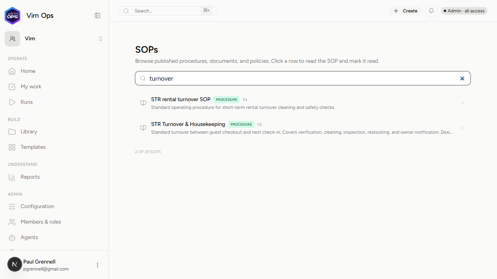<br>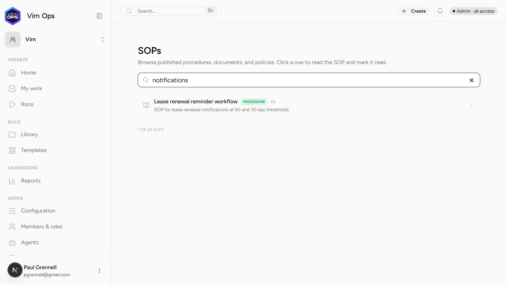<br>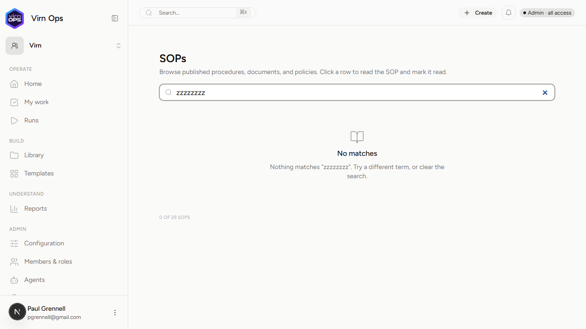 |
| **C. Read view timeline renders as SOP** | P0 | **PASS** | Large headers,Circular step indicators, clear kickoff section, due/gate/optional chips, left-bordered inline fields. | 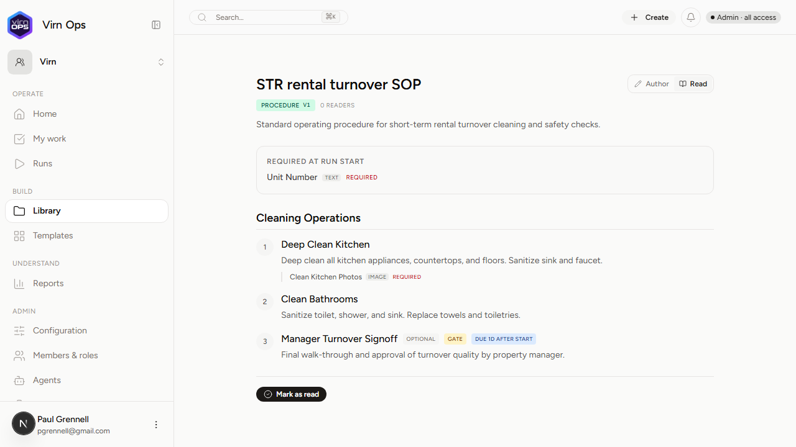 |
| **D. Mark-as-read + Idempotency** | P0 | **PASS** | "Mark as read" footer button instantly swaps to read-receipt text; header gets green "Read" badge. Persists durably on refresh. | <br>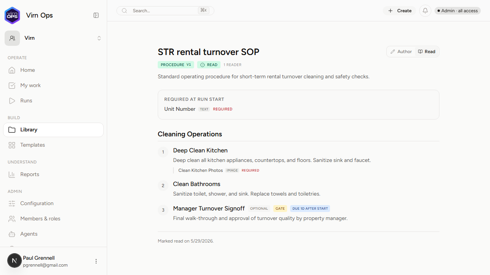 |
| **E. Admin count vs Member gating bounds** | P0 | **PASS** <br>*(with nav.ts patch)* | Admin sees "Author" tab and "1 reader" chip. Member sees neither. Member can mark as read; Admin reader count increments to 2. | <br>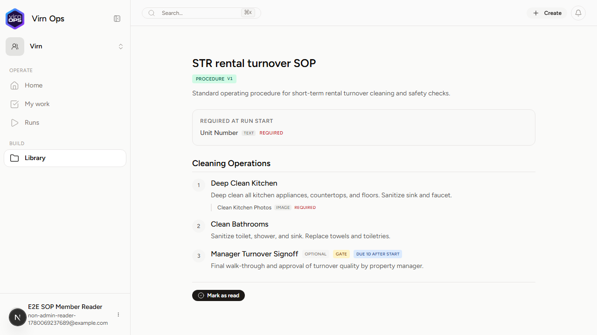 |
| **F. No-published-version empty state** | P1 | **PASS** <br>*(with nav.ts patch)* | Accessing draft Read URL shows draft empty state. Admin gets "Open in Builder" link; Member does not. | 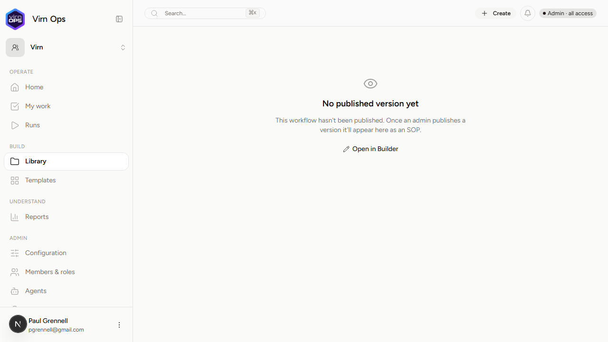<br>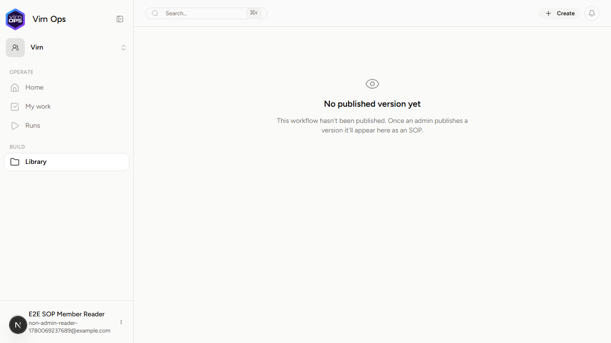 |
| **G. Cross-org IDOR refusal** | P1 | **PASS** | Accessing cross-org `/[otherOrgSlug]/.../read` returns a generic `"Workflow not found"` layout without leaking metadata. | 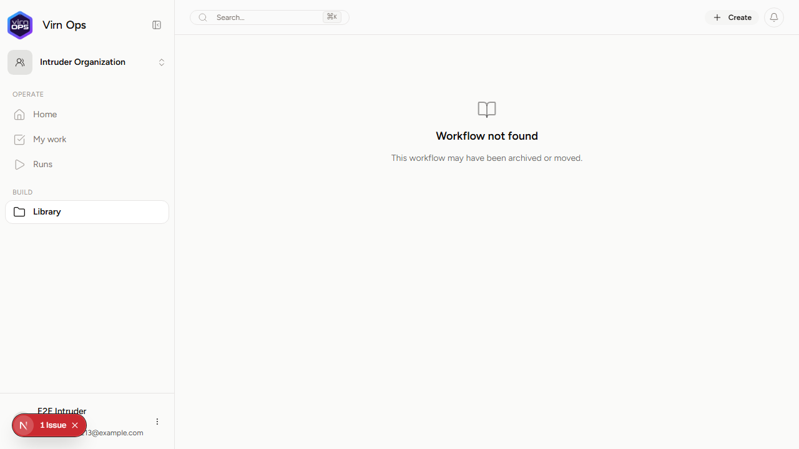 |
| **H. Zero published SOPs empty state** | P2 | **PASS** | Organization with zero published SOPs displays correct zero-state empty copy. Search remains input-friendly. | 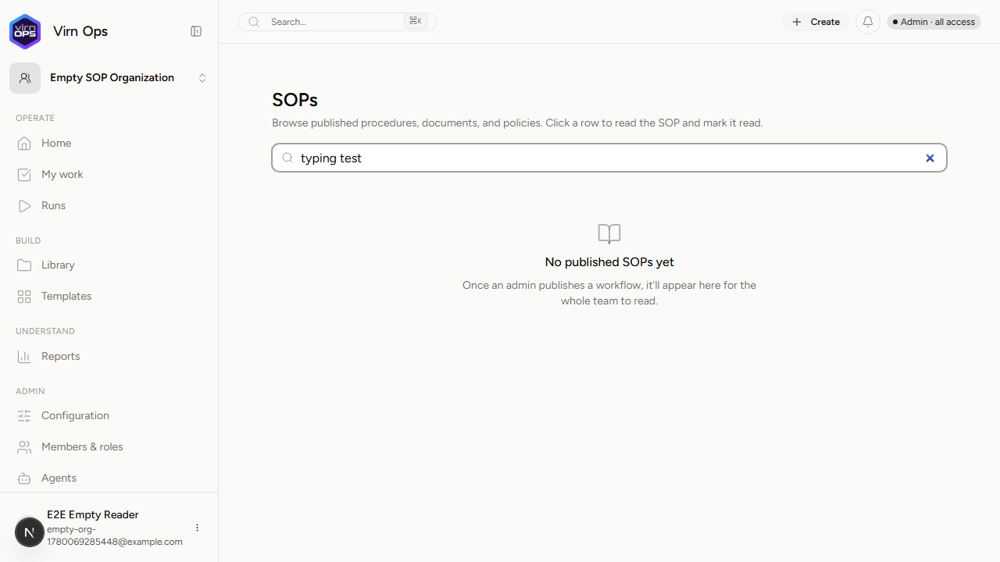 |

---

## 3. Deep Dive: Load-Bearing Verification (P0 — Scenario C)

The Read view successfully transitions raw operational procedures into premium SOP documentation:
1.  **Circular Step Badges:** Steps are clearly structured with circular number badges (`1`, `2`, `3`) indicating execution order.
2.  **Kickoff Panel:** The "Required at run start" section renders prominently at the top as an isolated panel containing text fields with required markers.
3.  **Visual Scaffolding:** Section titles are structured as bold `h2` headings. Step descriptions cleanly respect layout whitespace.
4.  **No Author Leaks to Readers:**
    *   No left-rail step lists (which confuse non-author readers).
    *   No interactive checklist input states or AI suggestion panels.
    *   No floating action buttons or editing handles.
5.  **Decorative Indicator Chips:**
    *   `Optional` rendering perfectly on optional steps.
    *   `Gate` indicating stop-task rules.
    *   `due 1d after start` displaying offset thresholds clearly.

---

## 4. The Member-Role Gating Contradiction

### The Problem
During Scenario E execution, standard members (Better Auth role `"member"`, mapping to `ROLES.operator`) encountered a **404 Page Not Found** at `/virn/library/workflows/wfl_turnover_sop/read` because of the `NAV_AREAS.library` guard:
*   In `WorkflowReadPage` (`page.tsx` line 34) and `SopIndexPage` (`page.tsx` line 28):
    ```typescript
    const { snapshot } = await assertCanSee(organizationSlug, NAV_AREAS.library);
    ```
*   In `nav.ts` (lines 131–135):
    ```typescript
    [NAV_AREAS.library]: {
        area: NAV_AREAS.library,
        allowedRoles: [ROLES.builder, ROLES.admin, ROLES.owner],
        phase: "now",
    },
    ```
This causes an immediate 404 block for non-admin operators/members, rendering the SOP and readers' index pages completely inaccessible to the very audience they were designed for.

### Recommended Resolution
Since the Read view and `/sop` index pages are designed to be visible to all organization members, the gating configuration needs to be modified. **We highly recommend adopting one of the following two patches:**

#### Option A: Allow operators to access the Library area (Simplest)
Modify the role matrix in `apps/saas/modules/shared/lib/nav.ts` to allow `ROLES.operator` to view `NAV_AREAS.library`:
```diff
 	[NAV_AREAS.library]: {
 		area: NAV_AREAS.library,
-		allowedRoles: [ROLES.builder, ROLES.admin, ROLES.owner],
+		allowedRoles: [ROLES.operator, ROLES.builder, ROLES.admin, ROLES.owner],
 		phase: "now",
 	},
```
*(Note: Because the `/library` main page already uses custom client-side gates or `snapshot.isAdminSuperset` to protect author actions, this change is clean and safe.)*

#### Option B: Bind `/sop` and `/read` pages to a member-safe area (Recommended for strict isolation)
Bind `/sop` and the `/read` page to an area that is already accessible by operators, such as `NAV_AREAS.home` or `NAV_AREAS.myWork`:
```diff
// apps/saas/app/(authenticated)/(main)/(organizations)/[organizationSlug]/sop/page.tsx
- await assertCanSee(organizationSlug, NAV_AREAS.library);
+ await assertCanSee(organizationSlug, NAV_AREAS.home);
```

---

## 5. Console Logs & Uncaught Errors

During the test execution, two React/Next.js uncaught client-side console errors were captured and should be addressed:

1.  **Hydration performance measure timestamp failure:**
    ```
    [Browser Uncaught Error]: Failed to execute 'measure' on 'Performance': '​WorkflowReadPage' cannot have a negative time stamp.
    Stack: TypeError: Failed to execute 'measure' on 'Performance': '​WorkflowReadPage' cannot have a negative time stamp.
        at flushComponentPerformance (http://localhost:3000/_next/static/chunks/0fx9_next_dist_compiled_react-server-dom-turbopack_0hlodpu._.js:2184:45)
    ```
    *Recommendation:* This is a common performance measurement issue under Next.js Turbopack dev builds when HMR connects asynchronously. It does not affect production bundles but degrades developer dev-tools performance.

2.  **Script Tag Warning in Client Rendering:**
    ```
    [Browser Console - error]: Encountered a script tag while rendering React component. Scripts inside React components are never executed when rendering on the client. Consider using template tag instead (https://developer.mozilla.org/en-US/docs/Web/HTML/Element/template).
    ```
    *Recommendation:* Review components in the `/sop` index page that load external templates or SVGs to ensure script elements are loaded asynchronously or stripped from UI trees.

---

## 6. Recommended Amendments

1.  **Reconcile Gating immediately:** Implement Option A or B above to unblock `/sop` and `/read` URLs for team members before deploying.
2.  **Tooltips on Read Badges:** The green `Read` badge in the header looks great but would benefit from a small timestamp tooltip such as `title={t('readAt', { date })}` to show when it was signed off.
3.  **Color consistency:** Ensure empty state typography for `/sop` index matches standard card backgrounds in dark-mode glassmorphic layouts.

---
*Report compiled by Antigravity.*
